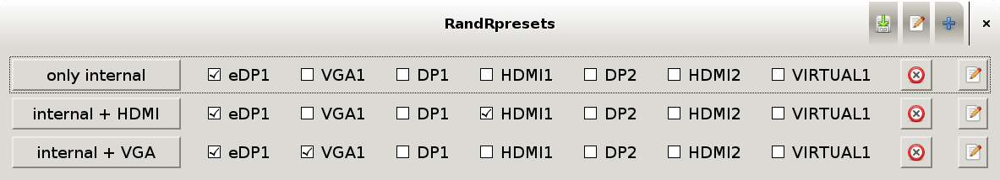

randrpresets
============

my new super cool monitor switchung utility.
--------------------------------------------

Instantly create and apply presets for your xrandr monitor setup.
Especially useful for laptop users who routinely connect external monitors or projectors to their machine.

usage
-----

Just start it (requires python3 and pygtk).
Add a new preset using the `+` button.
Tick the screens you want to activate.
Rename a preset using the pencil button on the right, click the bin to delete it.
Click the button on the left to apply a preset.

Use the pencil icon in the top bar to specify a `post command`.
This command is executed after the a preset is applied, e.g. for updating wallpapers or settings for your docking station's keyboard.

Save everything using the disk icon at the top.
